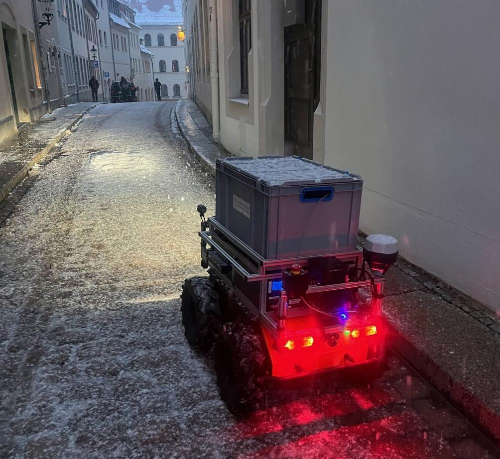
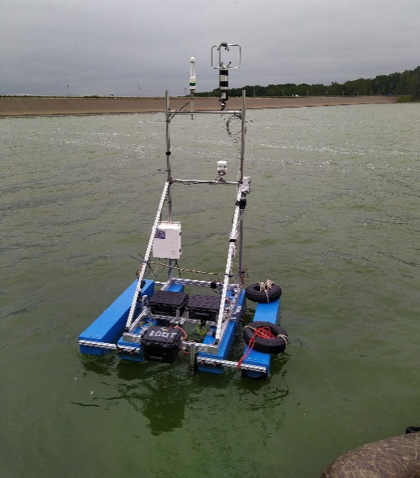
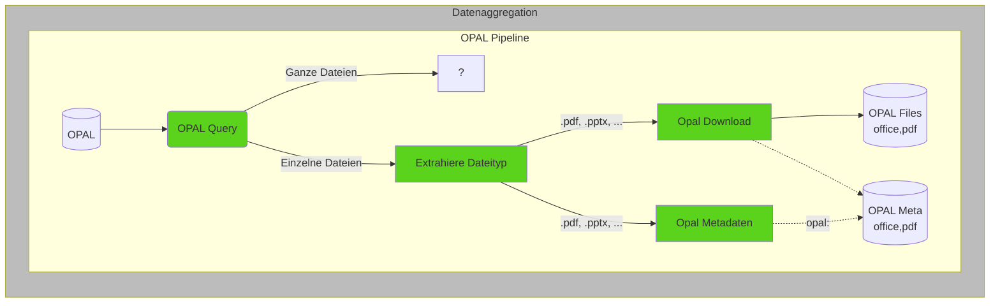
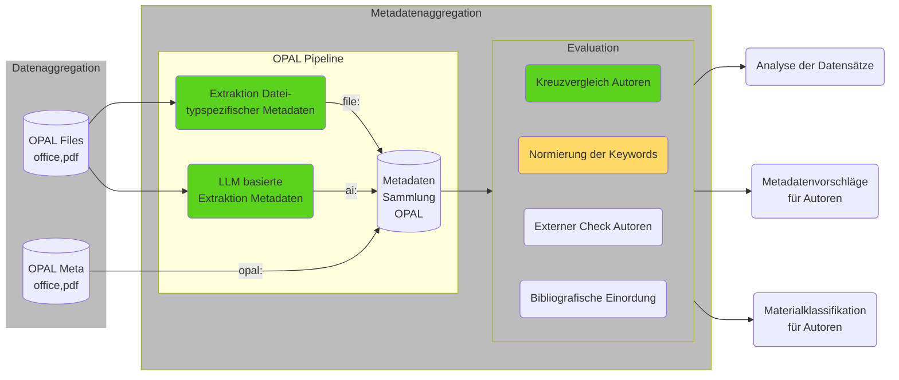

<!--
author:   Sebastian Zug; André Dietrich

email:    sebastian.zug@informatik.tu-freiberg.de

version:  0.1.0

language: en

narrator: UK English Female

icon:     https://media.aubi-plus.com/institution/thumbnail/3f3de48-technische-universitaet-bergakademie-freiberg-logo.jpg

link:     style.css

import:   https://raw.githubusercontent.com/liaTemplates/ABCjs/main/README.md
          https://raw.githubusercontent.com/liaTemplates/AVR8js/main/README.md

          https://raw.githubusercontent.com/LiaScript/CodeRunner/master/README.md
          https://raw.githubusercontent.com/liascript-templates/plantUML/master/README.md
          https://raw.githubusercontent.com/liaScript/mermaid_template/master/README.md
-->

[](https://liascript.github.io/course/?https://raw.githubusercontent.com/TUBAF-IFI-ConnectedLecturer/Presentations/main/Wel2024/Presentation.md)

# OER – Connected Lecturers

<h2>Projektziele und Status der Umsetzung</h2>

---

| Partner an der TUBAF                      | Projektbeteiligte             |
| ----------------------------------------- | ----------------------------- |
| Lehrstuhl Softwaretechnologie und Robotik | André Dietrich, Sebastian Zug |
| Universitätsbibliothek                    | Oliver Löwe                   |


<h5><p>Prof. Dr. Sebastian Zug, Workshop on e-Learning 2024, Görlitz</p></h5>

---

> Das Vorhaben wird durch die AG Elearning Sachsen gefördert. 

> Dieser Vortrag ist eine Open Educational Resource (OER) und steht unter der Lizenz [CC BY 4.0](https://creativecommons.org/licenses/by/4.0/deed.de). Alle enthaltenen Inhalte können frei verwendet werden und sind unter https://github.com/TUBAF-IFI-ConnectedLecturer/Presentations/blob/main/Wel2024/Presentation.md verfügbar

## Kurzvorstellung der Projektpartner

             {{0-3}}
***********************************

__Arbeitsgruppe Softwaretechnologie und Robotik__

***********************************

             {{0-2}}
***********************************

+ _Forschungsfeld 1: Robotik_

   
   

***********************************

{{1-2}}
> Wie vermittelt man technische Fragestellungen, die einen hohen Hardwareaufwand benötigen?

             {{2-3}}
***********************************

+ _Forschungsfeld 2: Digitale Lehre_

    Die Arbeitsgruppe entwickelt LiaScript und Edrys als Open Source Lernplattformen für die digitale Lehre.

!?[](https://github.com/TUBAF-IfI-LiaScript/.github/assets/10922356/00a24602-dc63-4b9a-894b-80967b914513 "Darstellung der kollaborativen Entwicklung der Vorlesungsmaterialien mit Studierenden unterschiedlicher Studiengänge")

***********************************

             {{3-4}}
***********************************

__Universitätsbibliothek der Bergakademie Freiberg__

***********************************

## Ausgangspunkt OER

> _Open Educational Resources (OER) sind Bildungsmaterialien jeglicher Art und in jedem Medium, die unter einer offenen Lizenz stehen. Eine solche Lizenz ermöglicht den kostenlosen Zugang sowie die kostenlose Nutzung, Bearbeitung und Weiterverbreitung durch Dritte ohne oder mit geringfügigen Einschränkungen._ (Quelle: [UNESCO](https://www.unesco.de/bildung/open-educational-resources))


_Ich veröffentliche meine Lehrmaterialien und freue mich darüber, wenn andere Dozierende/Lernende diese nutzen._

    [(immer )] immer
    [(bisweilen )] bisweilen
    [(gar nicht )] gar nicht

_Ich nutze Materialien anderer Dozierender._

    [(häufig )] immer
    [(bisweilen )] bisweilen
    [(gar nicht )] gar nicht

_Ich habe bereits Inhalte in OPAL mit einer offenen Lizenz hochgeladen._

    [(ja )] ja
    [(nein )] nein

### Motivation

<div id="example">
<wokwi-led color="red"   pin="13" label="13"></wokwi-led>
<wokwi-led color="green" pin="12" label="12"></wokwi-led>
<wokwi-led color="blue"  pin="11" label="11"></wokwi-led>
<wokwi-led color="blue"  pin="10" label="10"></wokwi-led>
<span id="simulation-time"></span>
</div>

``` cpp
byte leds[] = {13, 12, 11, 10};
void setup() {
  Serial.begin(115200);
  for (byte i = 0; i < sizeof(leds); i++) {
    pinMode(leds[i], OUTPUT);
  }
}

int i = 0;
void loop() {
  Serial.print("LED: ");
  Serial.println(i);
  digitalWrite(leds[i], HIGH);
  delay(250);
  digitalWrite(leds[i], LOW);
  i = (i + 1) % sizeof(leds);
}
```
@AVR8js.sketch(example)

### Herausforderungen bei der Integration von OER

1. _Rechtliche Unsicherheiten_
2. _Technische Hürden_
3. ___Aufwändige Suche nach passenden Materialien___
4. ...

> "_Vorstudie zur OER-Initiative sächsischer Hochschulen_" (2023-2024) [Link](https://www.hd-sachsen.de/projekte/oer-initiative-02/2023-07/2024)

> "_Offene Bildungsinfrastrukturen - Anforderungen an eine OER-förderliche IT-Infrastruktur_" (2023), HIS-Institut für Hochschulentwicklung e. V, [Link](https://medien.his-he.de/publikationen/detail/offene-bildungsinfrastrukturen)

> "_Didaktische Metadaten in OER- und Lehrportalen Von der Prämisse pädagogischer Neutralität zur Stärkung einer offenen Lehrpraxis_" (2024), HIS-Institut für Hochschulentwicklung e. V, [Link](https://medien.his-he.de/fileadmin/user_upload/Publikationen/Forum_Hochschulentwicklung/HIS-HE-Forum_Didaktische_Metadaten_in_OER-_und_Lehrportalen.pdf)

### Besondere Motivation\
 mit Blick auf OPAL

Das Projekt XXX zielte darauf ab die Integration von OER in OPAL zu erleichtern. Entsprechend finden sich die OER-Inhalte als Suchgegenstand in der gewohnten Recherche-Umgebung.

```text @plantUML.png
@startuml
skinparam style strictuml
alt Ist-Zustand
OERAutor_A as "OER\nAutorin" -> OPAL as "OPAL \n ": neues Dokument ohne Metadaten
Lernender_A as "Eingeschriebener\nLenender"--> OPAL : <font color=gray>Zugriff aus dem \n<font color=gray>OPAL Kurs
OPAL --> Lernender_A : <font color=gray>Dokument
OPAL -[#green]> UB_Katalog as "UB \nKatalog": Spiegelung
OERAutor_B as "OER Autor\nLernender" -[#green]> UB_Katalog !!: Suche nach Lern-\nLern-material XY
end

@enduml
```

<iframe src="https://katalog.ub.tu-freiberg.de/Record/finc-172-7PHyQGI" title="Wenig vorbildlicher Datensatz"></iframe><!--style="width:100%; display:block; height: 100vh;"--> 

> Es fehlen die Metadaten für die gezielte Exploration der OER-Inhalte im OPAL!

### Ursachenforschung

")

## Projektziele

```text @plantUML.png
@startuml
skinparam style strictuml
alt Projektvision
OERAutor_A -> OPAL : neues Dokument
activate OPAL
OPAL -> OPAL: KI basierte Extraktion
OPAL ->  OERAutor_A: Vorschläge zu den Metadaten
deactivate OPAL
OERAutor_A -> OPAL : ggf. korrigierte Metadaten

OPAL -> UB_Katalog : Spiegelung angereicherter Metadaten
OERAutor_B -> UB_Katalog : Erweiterte Suche
UB_Katalog -> OERAutor_B : 

OPAL -> OERAutor_A : Hinweis auf alternative Materialien\nanderer Autoren

end

@enduml
```

----


```ascii
   Extraktion von Metadaten 
   Evaluation mit Autoren
 + Vorschlagssystem
-----------------------------
 = Connected Lecturers                                                   .
```

> In diesem Projekt fokussieren wir uns auf die Einzeldateien, die in OPAL hochgeladen werden. Ganze Kurse bleiben außen vor.

Insgesamt reden wir über 14.015 Datein! 55% gehören zu den 

<!--
data-type="barchart"
data-title="Datentypen im OPAL-OER Datensatz"
data-show
-->
| Dateityp | Anzahl |
| -------- | -----: |
| `.pdf`   |   6962 |
| `.jpg`   |   1237 |
| `.mkv`   |    869 |
| `.mp4`   |    602 |
| `.png`   |    563 |
| `.zip`   |    466 |
| `.docx`  |    441 |
| `.html`  |    430 |
| `.pptx`  |    224 |
| `.xlsx`  |    208 |
| `.m`     |    182 |
| `.py`    |    171 |
| `.ipynb` |    145 |
| `.mp3`   |    102 |
| `.epub`  |     88 |

## Status der Umsetzung

__Schritt 1: Aggregation der Daten__




> Interessanterweise konnten einige Dokumente nicht heruntergeladen bzw. nicht geöffnet werden. Hier waren einige OER schlicht und ergreifend mit einem Passwort geschützt.

__Schritt 2: Extraktion der Metadaten__




### Herausforderungen

### Fragen 


