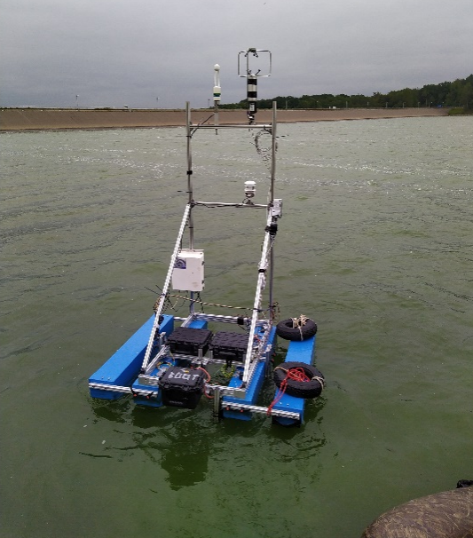
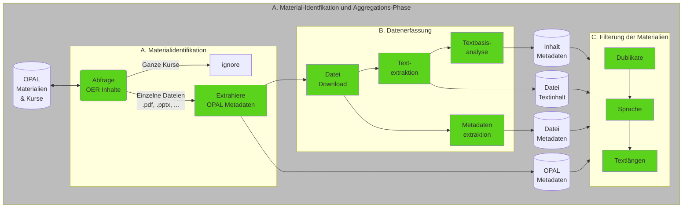
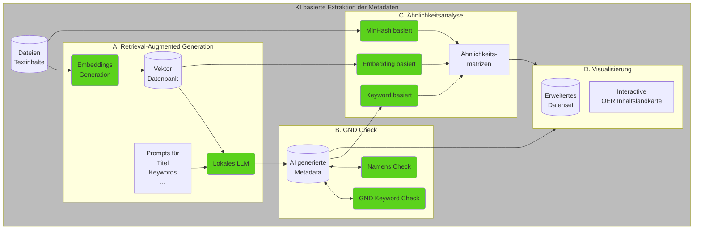
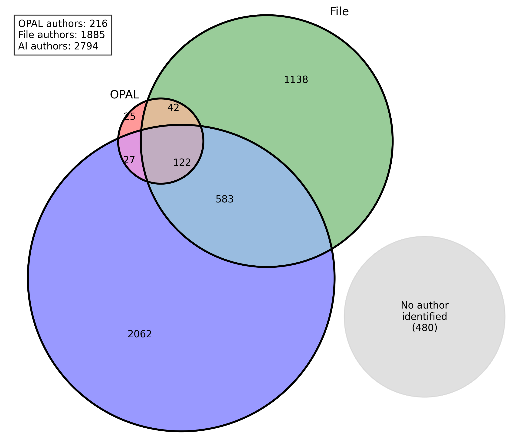
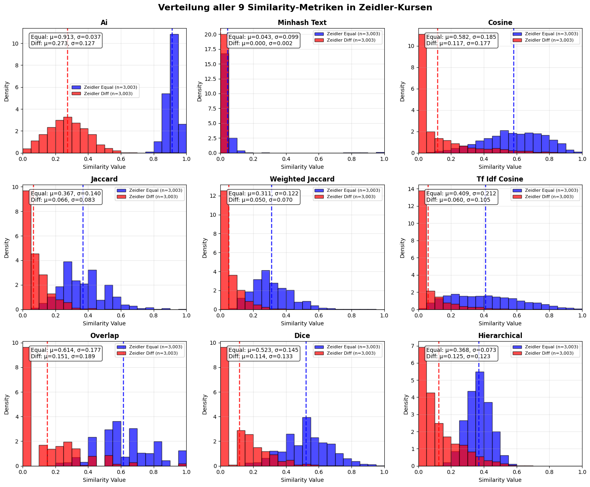
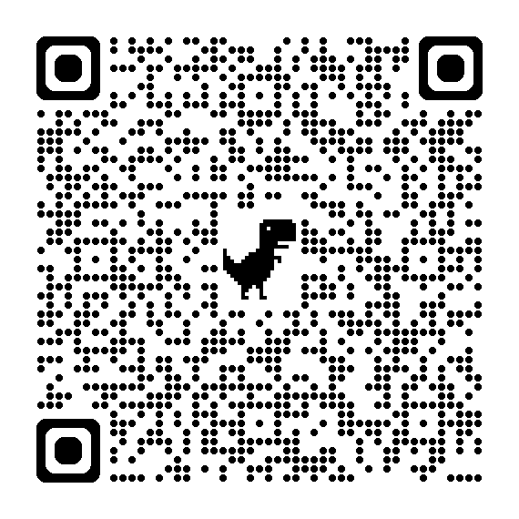

<!--
author:   Sebastian Zug; André Dietrich

email:    sebastian.zug@informatik.tu-freiberg.de

version:  0.1.2

language: en

narrator: UK English Female

icon:     TuBAF_Logo_schwarz.png

link:     style.css

import:   https://raw.githubusercontent.com/LiaTemplates/LiveEdit-Embeddings/refs/tags/0.0.1/README.md
          https://raw.githubusercontent.com/liascript-templates/plantUML/master/README.md
          https://raw.githubusercontent.com/liaScript/mermaid_template/master/README.md

                         

red:  @mark(#FF888888,@0)

-->

[](https://liascript.github.io/course/?https://raw.githubusercontent.com/TUBAF-IFI-ConnectedLecturer/Presentations/main/Wel2025/Presentation.md)

# OER – Connected Lecturers

<h2>Projektziele und Status der Umsetzung</h2>

---

| Partner an der TUBAF                      | Projektbeteiligte             |
| ----------------------------------------- | ----------------------------- |
| Lehrstuhl Softwaretechnologie und Robotik | André Dietrich, Sebastian Zug |
| Universitätsbibliothek                    | Oliver Löwe                   |


<h5><p>Prof. Dr. Sebastian Zug, Workshop on e-Learning 2025, Leipzig</p></h5>

---

> Das Vorhaben wird durch den [AK Elearning Sachsen](https://bildungsportal.sachsen.de/portal/parentpage/institutionen/arbeitskreis-e-learning-der-lrk-sachsen/) gefördert. 

<!-- class="reference"-->
> Dieser Vortrag ist eine Open Educational Resource (OER) und steht unter der Lizenz [CC BY 4.0](https://creativecommons.org/licenses/by/4.0/deed.de). Alle enthaltenen Inhalte können frei verwendet werden und sind unter https://github.com/TUBAF-IFI-ConnectedLecturer/Presentations/blob/main/Wel2025/Presentation.md verfügbar

## Kurzvorstellung der Projektpartner

             {{0-2}}
***********************************

__Arbeitsgruppe Softwaretechnologie und Robotik__

***********************************

             {{0-1}}
***********************************

+ _Forschungsfeld 1: Robotik_

   
   

***********************************

             {{1-2}}
***********************************

+ _Forschungsfeld 2: Digitale Lehre_

    Die Arbeitsgruppe entwickelt LiaScript und Edrys als Open Source Lernplattformen für die digitale Lehre.

```markdown @embed.style(height: 550px; min-width: 100%; border: 1px black solid)
# Vom Text zur Darstellung

__Mathematik__

$f(x) = x^2$

__Tabellen__

| X | B(y) | C(y) |
|---|:----:|:----:|
| 1 |   2  |   3  |
| 4 |   5  |   6  |

__Sprache__

> Click to run!
>
> {{|> Deutsch Female}}
> Markdown ist eine vereinfachte Auszeichnungssprache, die der Ausgangspunkt unserer Entwicklung von LiaScript war.
```

***********************************

             {{2-3}}
***********************************

__Universitätsbibliothek der Bergakademie Freiberg__

- Lehr- und forschungsunterstützende, informationswissenschaftliche Einrichtung an der TUBAF
- Traditionelle bibliothekarischen Aufgaben (Literaturbeschaffung, -bearbeitung, -distribution) verstärkt in modernen digitalen Bereichen aktiv

  - Open Access Publizieren
  - Forschungsdatenmanagement
  - Open Science
  - Metadatenmanagement / Data Science

- Übernahme von Smart Library Konzepten - Schaffung von Lehr- und Lernräumen (Podcaststudio, AR/VR-Räume)
- Intensive Kooperation mit den Wissenschaftlerinnen vor Ort z.B. Institut für Informatik

<!-- class="reference"-->
> "_Anreicherung digitaler Objekte mit Metadaten in OPAL – Implementierung einer Schnittstelle zur Anbindung externer Recherchesysteme_", 2017/2018, [Link](https://bildungsportal.sachsen.de/impulse/projekt/anreicherung-digitaler-objekte-mit-metadaten-in-opal-implementierung-einer-schnittstelle-zur-anbindung-externer-recherchesysteme/)


***********************************

## Warum Materialien teilen?

<!--
style="width: 100%; max-width: 860px; display: block; margin-left: auto; margin-right: auto;"
-->
```ascii

      Wunsch nach                                              Wunsch nach
  einfacher Umsetzung  -----------> Konflikt <----------- spezifischen Elementen
                                       |                       im Material
                                       |
                                       v
                              OER als Lösungsansatz

```

       {{1-2}}
> _Open Educational Resources (OER) sind Bildungsmaterialien jeglicher Art und in jedem Medium, die unter einer offenen Lizenz stehen. Eine solche Lizenz ermöglicht den kostenlosen Zugang sowie die kostenlose Nutzung, Bearbeitung und Weiterverbreitung durch Dritte ohne oder mit geringfügigen Einschränkungen._ (Quelle: [UNESCO](https://www.unesco.de/bildung/open-educational-resources))


### Auffindbarkeit als eine Hürde von OER

Welche Hemnisse sehen Lehrende bei der Verwendung von OER-Inhalten in Ihrer Lehre?

1. _Rechtliche Unsicherheiten_
2. _Technische Hürden_
3. _Fehlende Passgenauigkeit_
4. _Eigene Qualitätsstandards_
5. ___Aufwändige Suche nach passenden Materialien___
6. ...

<!-- class="reference"-->
> "_Vorstudie zur OER-Initiative sächsischer Hochschulen_" (2023-2024) [Link](https://www.hd-sachsen.de/projekte/oer-initiative-02/2023-07/2024)

<!-- class="reference"-->
> "_Offene Bildungsinfrastrukturen - Anforderungen an eine OER-förderliche IT-Infrastruktur_" (2023), HIS-Institut für Hochschulentwicklung e. V, [Link](https://medien.his-he.de/publikationen/detail/offene-bildungsinfrastrukturen)

<!-- class="reference"-->
> "_Didaktische Metadaten in OER- und Lehrportalen Von der Prämisse pädagogischer Neutralität zur Stärkung einer offenen Lehrpraxis_" (2024), HIS-Institut für Hochschulentwicklung e. V, [Link](https://medien.his-he.de/fileadmin/user_upload/Publikationen/Forum_Hochschulentwicklung/HIS-HE-Forum_Didaktische_Metadaten_in_OER-_und_Lehrportalen.pdf)

### Besondere Motivation mit Blick auf OPAL

Das Projekt der UB zielte 2018 darauf ab die Integration von OER in OPAL zu erleichtern. Entsprechend finden sich die OER-Inhalte als Suchgegenstand in der gewohnten Recherche-Umgebung.

<iframe src="https://katalog.ub.tu-freiberg.de/Record/finc-172-11m9Rh2RyvquE" title="Beispielhafter OPAL Datensatz im UB Suchfenster"></iframe><!--style="width:100%; display:block; height: 50vh;"--> 

> Es fehlen die Metadaten für die gezielte Exploration der OER-Inhalte im OPAL!

### Ursachenforschung

")

## Projektziele

```ascii
+-----------------------------------------------+
|    Extraktion von Metadaten                   |        
|    Evaluation mit Autoren                     |        
|  + Vorschlagssystem                           |
| ---------------------------                   |
|  = Connected Lecturers                        |    
+-----------------------------------------------+                                      .
```

> In diesem Projekt fokussieren wir uns auf die Einzeldateien, die in OPAL hochgeladen werden. Ganze Kurse bleiben außen vor.

## Umsetzung

   {{0-1}}
****************************************************************

__Schritt 1: Aggregation der Daten__



> Insgesamt reden wir über fast 15.000 Dateien. 55% davon gehören zu den Office Datei-Typen (`.pptx`, `.docx`, ...), `.md` und `.pdf` Dateien (Stand August 2025).
> Die Inhalte unterscheiden sich stark und reichen von gescannten handschriftlichen Notizen bis zu ganze Lehrbüchern.

****************************************************************


   {{1-2}}
****************************************************************

__Schritt 2: Extraktion der Metadaten__




Die Umsetzung der gesamten Pipeline ist unter url als Open Source verfügbar: [Data_aggregation](https://github.com/TUBAF-IFI-ConnectedLecturer/Data_aggregation) verfügbar. Die gesamte Pipeline ist in Python implementiert und nutzt für die AI Komponenten eine Nvidia DGX2. Als LLM kommt aktuell ein [llama3](https://ollama.com/library/gemma3) zum Einsatz.

****************************************************************

## Ergebnisse

> Beispieldatensatz von Oliver Löwe aus Freiberg ...

<!-- data-type="none" -->
| Label             | Wert                                                                                                                                                                                                                                                                                                                                                                                                          |
| --------------------- | ------------------------------------------------------------------------------------------------------------------------------------------------------------------------------------------------------------------------------------------------------------------------------------------------------------------------------------------------------------------------------------------------------------- |
| `opal:filename`         | cdvost_praesi.pptx |
| `opal:oer_permalink`    | https://bildungsportal.sachsen.de/opal/oer/1PGOlNUd1m7g |
| `opal:license`          | CC BY-NC 4.0 Int. |
| `opal:author`           | Oliver Löwe |
| `opal:title`            | Anlagen bergbaulicher Zeichnungen beim Kultur-Hackathon Coding Da Vinci |
| `opal:comment`          | Coding Da Vinci Ost von der Universitätsbibliothek Leipzig ausgetragen; 14./15.4.2018; UB Freiberg ist Datengeber der Leupoldsammlungen |
| `opal:language`         | Deutsch |
| `opal:publicationMonth` | 4 |
| `opal:publicationYear`  | 2018 |
| `opal:revisedAuthor`    | [Name(Vorname='Oliver', Familienname='Löwe', Titel='')] |
| `pipe:ID`               | 1PGOlNUd1m7g |
| `pipe:file_type`      | pptx |
| `file:author`           | Löwe Oliver |
| `file:keywords`         | |
| `file:subject`          | |
| `file:title`            | Zeichnungen bergbaulicher Anlagen (Leupoldsammlung) |
| `file:created`          | 2018-04-04 10:39:43+00:00 |
| `file:modified`         | 2018-04-14 11:24:44+00:00 |
| `file:language`         | |
| `file:revisedAuthor`    | [Name(Vorname='Oliver', Familienname='Löwe', Titel='')] |
| `ai:author`             | Oliver Löwe |
| `ai:revisedAuthor`      | [Name(Vorname='Oliver', Familienname='Löwe', Titel='')] |
| `ai:affilation`         | TU Bergakademie Freiberg |
| `ai:title`              | Zeichnungen bergbaulicher Anlagen (Leupoldsammlung) |
| `ai:type`               | Präsentation |
| `ai:keywords_ext`       | Montanwesen, Erzgebirge, Bergbaumuseum, Grubenlampen, Gezähe, bergmännische Uniformen, kunsthistorische Gegenstände, montanhistorischem Bezug, Autographen, Zeichnungen, Risse, Montanwissenschaft, TU Bergakademie Freiberg, Leupoldsammlung, Schwungradhaspel, Bartholomäus Schacht |
| `ai:keywords_gen`       | Montanwesen, Bergbau, Erzgebirge, Montanhistorie, Geognosie, Mineralogie, Lagerstättenlehre, Zeichnungen, bergbauliche Anlagen, Leupoldsammlung, TU Bergakademie Freiberg, Universitätsbibliothek, Deutsche Digitale Bibliothek, Europeana, MetsMods, OA1-PMH |
| `ai:keywords_dnb`       | Bergbau, Montanhistorie, Erzgebirge, Bergakademie, Geognosie, Mineralogie, Lagerstättenlehre, Technisches Zeichnen, Konstruktionszeichnen, Hochschulsammlungen |
| `ai:dewey`              | [{'notation': '930', 'label': 'Geschichte des Altertums bis ca. 499, Archäologie', 'score': 0.5}, {'notation': '940', 'label': 'Geschichte Europas', 'score': 0.3}, {'notation': '900', 'label': 'Geschichte und Geografie', 'score': 0.2}] |
| `ai:affiliation`        | TU Bergakademie Freiberg |
| `ai:summary`            | Die Leupoldsammlung umfasst historische Zeichnungen und Risse von bergbaulichen Anlagen, die für die montanhistorische Forschung von großer Bedeutung sind. Die Sammlung enthält Unikate und ermöglichte den originalgetreuen Nachbau eines Schwungradhaspels. Durch die digitale Bereitstellung dieser Sammlung können Nutzer Einblick in die Geschichte des Bergbaus und der Montanwissenschaften gewinnen. |

> Die DDC Klassifikation 622 trägt das Label "Bergbau und verwandte Tätigkeiten" vgl. [GND](https://lobid.org/gnd/4005614-4)

### Merkmalserschließung

**Autorenidentifikation generell ...**




### Ähnlichkeitsanalyse 

**Ähnlichkeit im Einzelfall ...**



### Darstellung der Ergebnisse 

+ tabellarisch 
+ als Graph ... und hier wird es jetzt spannend.

## Danke 

<div class="left">

> Vielen Dank für Ihr Interesse! Wir freuen uns auf Ihre Fragen und Anregungen.

Sebastian Zug

<a href="mailto:sebastian.zug@informatik.tu-freiberg.de">
    sebastian.zug@informatik.tu-freiberg.de 
</a>

------------------

Oliver Löwe

<a href="mailto:oliver.loewe@ub.tu-freiberg.de">
    oliver.loewe@ub.tu-freiberg.de
</a>

</div>

<div class="right">



</div>


